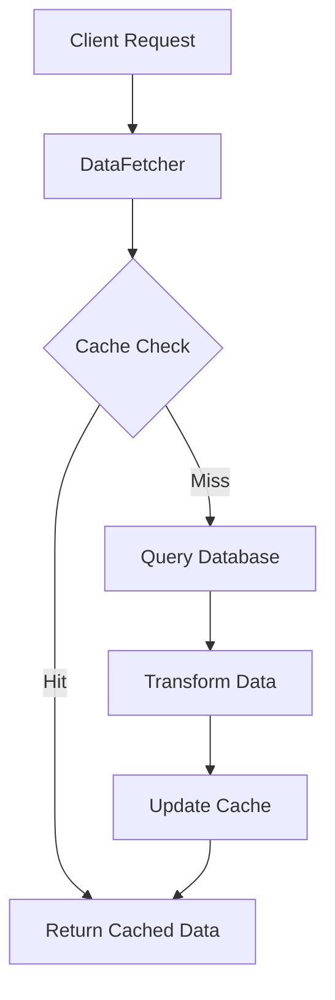
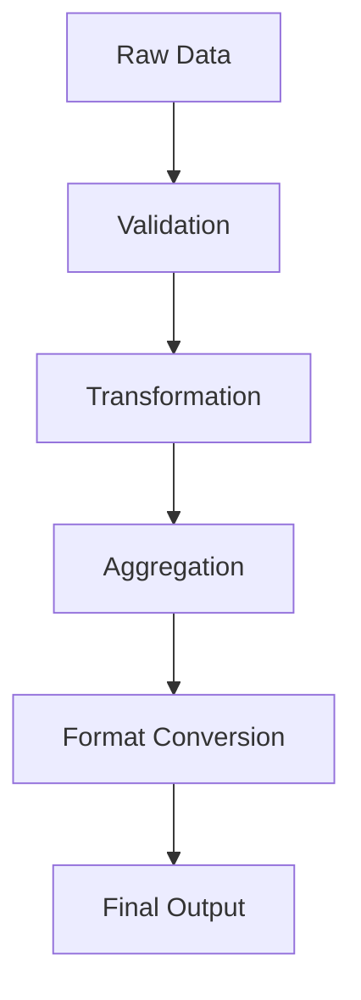

# Data Processing Documentation

## Overview
The data processing layer is responsible for fetching, transforming, and preparing adoption rate data for analysis and visualization. This layer implements caching, data transformation, and aggregation functionality to ensure efficient and consistent data handling throughout the application.

## Directory Structure
```
src/data_processing/
├── __init__.py
├── data_fetcher.py
└── data_processor.py
```

## Components

### 1. Data Fetcher (`data_fetcher.py`)

#### Purpose
Provides a high-level interface for retrieving adoption rate data from the database with built-in caching and optimization.

#### Key Features
- In-memory caching of frequently accessed data
- Date range handling and validation
- Batch data retrieval optimization
- Error handling and retry logic

#### Core Classes and Methods

##### DataFetcher
```python
class DataFetcher:
    def get_daily_active_users(
        from_date: datetime,
        to_date: datetime,
        tenant_id: int
    ) -> List[DailyActiveUsers]

    def get_monthly_active_users(
        from_date: datetime,
        to_date: datetime,
        tenant_id: int
    ) -> List[MonthlyActiveUsers]

    def get_overall_adoption_rate(
        from_date: datetime,
        to_date: datetime,
        tenant_id: int
    ) -> List[OverallAdoptionRate]

    def get_all_metrics(
        from_date: datetime,
        to_date: datetime,
        tenant_id: int
    ) -> Dict[str, List]

    def get_metrics_for_period(
        period: str,
        reference_date: datetime,
        tenant_id: int
    ) -> Dict[str, List]
```

#### Caching Strategy
- Cache key format: `{metric_type}:{tenant_id}:{from_date}:{to_date}`
- Cache expiration: 1 hour by default
- Cache invalidation: On data updates or manual trigger
- Memory limits: Configurable maximum cache size

#### Error Handling
- Connection errors: Automatic retry with exponential backoff
- Stale data: Automatic cache invalidation
- Invalid parameters: Detailed validation errors
- Missing data: Proper null handling

### 2. Data Processor (`data_processor.py`)

#### Purpose
Transforms and aggregates raw metric data into formats suitable for analysis and visualization.

#### Key Features
- Time series aggregation
- Statistical calculations
- Data normalization
- Format conversion

#### Core Classes and Methods

##### DataProcessor
```python
class DataProcessor:
    def aggregate_daily_metrics_to_weekly(
        daily_metrics: List[DailyActiveUsers]
    ) -> List[Dict]

    def aggregate_daily_metrics_to_monthly(
        daily_metrics: List[DailyActiveUsers]
    ) -> List[Dict]

    def calculate_adoption_rate_statistics(
        metrics: List[OverallAdoptionRate]
    ) -> Dict[str, float]

    def format_metrics_for_chart(
        metrics: List,
        chart_type: str
    ) -> Dict[str, List]

    def get_formatted_trend_description(
        metrics: List[OverallAdoptionRate]
    ) -> str
```

#### Aggregation Methods

1. Time-based Aggregation
```python
def aggregate_by_time_period(
    metrics: List,
    period: str,
    aggregation_func: Callable
) -> List[Dict]:
    """
    Aggregates metrics by specified time period
    
    Parameters:
        metrics: List of metric objects
        period: 'daily', 'weekly', 'monthly', or 'yearly'
        aggregation_func: Function to use for aggregation
    
    Returns:
        List of aggregated metrics
    """
```

2. Statistical Aggregation
```python
def calculate_statistics(
    metrics: List,
    metric_type: str
) -> Dict[str, float]:
    """
    Calculates statistical measures for metrics
    
    Parameters:
        metrics: List of metric objects
        metric_type: Type of metric to analyze
    
    Returns:
        Dictionary of statistical measures
    """
```

#### Data Transformation

1. Format Conversion
```python
def convert_to_chart_format(
    metrics: List,
    format_type: str
) -> Dict:
    """
    Converts metrics to specified chart format
    
    Parameters:
        metrics: List of metric objects
        format_type: Target format type
    
    Returns:
        Formatted data for visualization
    """
```

2. Normalization
```python
def normalize_metrics(
    metrics: List,
    method: str
) -> List:
    """
    Normalizes metric values using specified method
    
    Parameters:
        metrics: List of metric objects
        method: Normalization method
    
    Returns:
        Normalized metrics
    """
```

## Data Flow

### 1. Data Retrieval Flow


### 2. Data Processing Flow


## Performance Optimization

### Caching Strategy
1. Memory Cache
   - Fast access to frequent queries
   - Configurable size limits
   - LRU eviction policy

2. Result Set Caching
   - Caches transformed results
   - Reduces processing overhead
   - Automatic invalidation

### Batch Processing
1. Batch Data Retrieval
   - Minimizes database calls
   - Optimizes network usage
   - Reduces latency

2. Parallel Processing
   - Concurrent data transformation
   - Async database queries
   - Thread pool management

## Error Handling

### Data Validation
```python
def validate_input_data(
    data: Dict,
    validation_rules: Dict
) -> bool:
    """
    Validates input data against rules
    
    Parameters:
        data: Input data dictionary
        validation_rules: Validation rules
    
    Returns:
        True if valid, raises ValidationError otherwise
    """
```

### Error Recovery
```python
def handle_processing_error(
    error: Exception,
    context: Dict
) -> None:
    """
    Handles processing errors with context
    
    Parameters:
        error: Exception object
        context: Error context dictionary
    """
```

## Configuration

### Cache Settings
```python
CACHE_CONFIG = {
    'max_size': 1000,  # Maximum number of cached items
    'ttl': 3600,       # Time to live in seconds
    'strategy': 'lru'  # Cache eviction strategy
}
```

### Processing Settings
```python
PROCESSING_CONFIG = {
    'batch_size': 1000,    # Maximum batch size for processing
    'thread_pool_size': 4, # Number of processing threads
    'timeout': 30         # Processing timeout in seconds
}
```

## Testing

### Unit Tests
1. Data Fetching Tests
   - Cache hit/miss scenarios
   - Error handling cases
   - Parameter validation

2. Processing Tests
   - Aggregation accuracy
   - Transformation correctness
   - Performance benchmarks

### Integration Tests
1. End-to-end Flow Tests
   - Complete data pipeline
   - Error recovery
   - Cache behavior

2. Performance Tests
   - Load testing
   - Concurrency testing
   - Memory usage

## Monitoring

### Metrics
1. Performance Metrics
   - Processing time
   - Cache hit rate
   - Memory usage

2. Error Metrics
   - Error rate
   - Error types
   - Recovery success rate

### Logging
1. Operation Logs
   - Processing steps
   - Cache operations
   - Error details

2. Performance Logs
   - Timing information
   - Resource usage
   - Bottlenecks

## Best Practices

### Data Fetching
1. Use batch operations when possible
2. Implement proper error handling
3. Validate input parameters
4. Monitor cache effectiveness

### Data Processing
1. Use appropriate data structures
2. Implement efficient algorithms
3. Handle edge cases properly
4. Maintain type consistency

### Error Handling
1. Provide detailed error messages
2. Implement proper logging
3. Handle recovery gracefully
4. Maintain data consistency

## Future Improvements

### Planned Enhancements
1. Advanced caching strategies
2. Improved batch processing
3. Better error recovery
4. Enhanced monitoring

### Technical Debt
1. Optimize memory usage
2. Improve error handling
3. Enhance documentation
4. Add performance metrics 